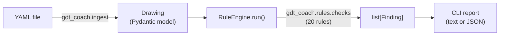

# gdt-coach

[](https://github.com/mustafabaylamak/gdt-coach/actions/workflows/ci.yml)
[](LICENSE)
[](pyproject.toml)

A deterministic rule engine that checks **GD&T (Geometric Dimensioning
and Tolerancing)** callouts on a drawing against **ASME Y14.5** rules,
and explains *why* each violation is wrong — not just that the input
was invalid.

```bash
$ gdt-coach check examples/invalid_flatness_with_datum.yaml
Checked examples/invalid_flatness_with_datum.yaml -- drawing 'dwg-002' ('Cover Plate')
Rules run: 20

[ERROR] flatness-no-datum-references: Flatness cannot reference datums
  flatness feature control frame 'fcf-1' references datum(s) ['A'], but flatness must not reference any datum
  location: feature=feat-surface-1 fcf=fcf-1

1 finding(s): 1 error
```

## Why

GD&T is a precise, symbolic language for specifying part geometry and
tolerances (ASME Y14.5 / ISO 1101). It's also easy to author
incorrectly in ways that look plausible: a flatness callout that
references a datum it shouldn't, a position tolerance on a surface
that isn't a Feature of Size, an MMC modifier on a characteristic that
must always be RFS. These mistakes are common, well-defined, and
mechanical to check — which makes them a good fit for an automated,
deterministic rule engine rather than manual review.

`gdt-coach` reads a drawing described in YAML, validates it into a
typed domain model, and runs it against a registry of independent
rules. Each violation comes back as a structured `Finding` — a rule id,
a severity, a human-readable explanation, and exactly which feature or
feature control frame it's about.

## Architecture



Four independent layers: a **domain model** (`gdt_coach.models`) that
knows nothing about GD&T rules, only what data is structurally valid; a
**rule engine** (`gdt_coach.rules`) that knows nothing about any
specific rule, only how to run one; 20 **concrete rules**
(`gdt_coach.rules.checks`), each an independent, self-registering
module; and a thin **YAML ingest** layer and **CLI** that wire the
pieces together. See [ARCHITECTURE.md](ARCHITECTURE.md) for the full
design, including every rule's known limitations.

## Installation

Requires Python 3.11+.

```bash
git clone https://github.com/mustafabaylamak/gdt-coach.git
cd gdt-coach
python -m venv .venv
source .venv/bin/activate  # On Windows: .venv\Scripts\activate
pip install -e ".[dev]"
pre-commit install
```

## Quick start

```bash
gdt-coach --version
gdt-coach check examples/valid_position.yaml         # exit 0, no findings
gdt-coach check examples/invalid_flatness_with_datum.yaml  # exit 1, one finding
```

Narrow which rules run, or get machine-readable output:

```bash
gdt-coach check examples/valid_position.yaml --category tolerance
gdt-coach check examples/invalid_projected_zone.yaml --json
```

See [examples/README.md](examples/README.md) for all seven bundled
examples (six YAML, one CSV), what each one demonstrates, and their
exact output (generated from the real CLI, not hand-written).

Exit codes: `0` no findings, `1` one or more findings, `2` the input
couldn't be checked (malformed input, an unsupported file extension,
missing file, failed domain-model validation, an invalid
`--category`/`--standard` value, or passing `--json` and `--markdown`
together).

## Markdown reports for CI and review

`--markdown` renders the same check as a GitHub-flavored Markdown
report instead of the default plain-text output — meant for pasting
into a CI job summary (e.g. `$GITHUB_STEP_SUMMARY`) or a pull-request
comment, so a GD&T issue is visible in the review itself instead of
buried in a build log:

```bash
gdt-coach check examples/invalid_flatness_with_datum.yaml --markdown
```

```
# GD&T Check Report

## Drawing

| Field | Value |
|---|---|
| Source | examples/invalid\_flatness\_with\_datum.yaml |
| Drawing ID | dwg-002 |
| Title | Cover Plate |
| Rules run | 20 |

## Summary

| Severity | Count |
|---|---:|
| Error | 1 |
| **Total** | 1 |

## Findings

### ERROR - flatness-no-datum-references

**Rule:** Flatness cannot reference datums

flatness feature control frame 'fcf-1' references datum(s) \['A'], but flatness must not reference any datum

**Location:** feature=feat-surface-1, fcf=fcf-1
```

`--markdown` is mutually exclusive with `--json` — passing both is
rejected by `argparse` before anything runs (stderr, exit code 2).
Exit codes are otherwise exactly the same as plain-text/JSON output:
`0` no findings, `1` one or more findings (any severity), `2` an
input/argument error — `--markdown` only changes presentation, never
which findings are reported.

## Checking multiple files or a directory (Sprint 16)

`gdt-coach check` accepts more than one path:

```bash
gdt-coach check drawing-a.yaml drawing-b.csv         # multiple explicit files
gdt-coach check drawings/                            # a directory of drawings
gdt-coach check drawings/ extra-drawing.yaml         # mixed
```

More than one path, or any path that's a directory, switches from the
single-file report to an aggregate **batch report** in the same
text/JSON/Markdown formats `check` already produces — nothing new to
learn per format, just one report covering every file instead of one.

- **Directory scanning is non-recursive.** Only a directory's immediate
  files are considered; a subdirectory inside it is silently not
  descended into. There's no glob syntax — pass a directory and let it
  scan, or list files explicitly.
- **Which extensions count as "supported" is never hardcoded.** A
  directory scan includes exactly the extensions the registered
  `InputAdapter`s claim (`.yaml`/`.yml`/`.csv` today, case-insensitive)
  — adding a future input format automatically extends what directory
  scanning picks up, with no change to this logic.
- **The same file is only ever checked once.** Supplying it explicitly
  and also having it turn up inside a directory argument (or listing
  two overlapping directories) is deduplicated by resolved path
  identity; only the first occurrence is checked and reported.
- **A single explicit file is still the exact single-file report** from
  the sections above, byte-for-byte — batch mode only activates for
  more than one path argument, or a directory. A directory that happens
  to contain exactly one matching file still produces the aggregate
  batch shape, not the single-file one, since it's the *arguments* that
  decide the mode, not how many files happen to be found.
- **Partial failure never stops the batch.** A missing path, an
  unsupported extension, or a malformed file is reported inline (in
  whichever format was requested) as a failed entry, and every other
  file is still checked and reported.

A real two-file run (path separators in batch-mode output follow the
OS — this capture is from Windows; a Linux/macOS/CI run shows `/`):

```bash
$ gdt-coach check examples/valid_position.yaml examples/invalid_flatness_with_datum.yaml
======================================================================
Checked examples\valid_position.yaml -- drawing 'dwg-001' ('Mounting Bracket')
Rules run: 20

No findings.

======================================================================
Checked examples\invalid_flatness_with_datum.yaml -- drawing 'dwg-002' ('Cover Plate')
Rules run: 20

[ERROR] flatness-no-datum-references: Flatness cannot reference datums
  flatness feature control frame 'fcf-1' references datum(s) ['A'], but flatness must not reference any datum
  location: feature=feat-surface-1 fcf=fcf-1

1 finding(s): 1 error

======================================================================
Summary
Input items supplied: 2
Files discovered: 2
Files checked: 2
Files failed: 0
Files with findings: 1
Total findings: 1
By severity: 1 error
```

`--json` produces `{"results": [...], "summary": {...}}` — one entry
per file (`"status": "checked"` with `drawing`/`rules_run`/`findings`,
or `"status": "error"` with `{"type", "message"}`) plus aggregate
counts (`inputs_supplied`, `files_discovered`, `files_checked`,
`files_failed`, `files_with_findings`, `total_findings`,
`severity_counts`). `--markdown` produces a `# GD&T Batch Check
Report` with a `## Summary` table and one `### \`<path>\`` section per
file under `## Results`, reusing the same escaping rules as the
single-file Markdown report.

**Exit codes** generalize the single-file rule across the whole batch:
`0` if every file checked clean, `1` if every file at least loaded and
any of them has a finding (any severity) but nothing failed to load,
`2` if any path couldn't be resolved, loaded, or parsed — matching
`check`'s existing "any load/argument error is exit 2" precedent, now
applied per-file across the batch instead of to a single file.

A compact CI example — check every drawing in the repository and post
the result as a job summary:

```yaml
- name: Check GD&T drawings
  run: gdt-coach check drawings/ --markdown >> "$GITHUB_STEP_SUMMARY"
```

See [ARCHITECTURE.md](ARCHITECTURE.md#batch-mode-sprint-16) for the
full design, including exactly how single-file mode is kept
byte-identical.

## CSV input: a second, narrow format

`gdt-coach check drawing.csv` works the same as YAML — same rule
engine, same CLI, same exit codes — but CSV is **intentionally
limited**, not a second way to author anything YAML can:

- **YAML remains the expressive, native format.** It mirrors the
  domain model directly and supports everything `Drawing` can express.
- **CSV is not equivalent to a technical drawing**, and supporting it
  does not imply readiness for PDF, DXF, or any other unstructured
  format — it's a flat, already-structured text format, the easiest
  possible second input to support, not evidence the hard cases are
  solved.
- One CSV file is one `Drawing`; one row is one `Feature` with at most
  one `Dimension` and at most one `FeatureControlFrame`. Datum
  references are a semicolon-delimited field (`"A;B;C"`).
- **CSV cannot declare `Datum` objects** — a CSV-sourced `Drawing`
  always has `datums == []`. Referencing a datum label via
  `fcf_datum_refs` will correctly trigger the existing
  `datum-reference-must-be-defined` rule, exactly as it would for any
  other undefined datum reference — see
  [examples/invalid_datum_reference_undefined.csv](examples/invalid_datum_reference_undefined.csv).
- Unsupported structures (multiple dimensions/FCFs per feature,
  `related_dimension_ids`, composite tolerances, geometry) are
  **rejected with a clear error, never silently approximated or
  guessed at**.

See [ARCHITECTURE.md](ARCHITECTURE.md#csv-ingest-contract-sprint-14)
for the full column-by-column contract and every documented limitation.

## Rule catalog

`gdt-coach rules list` and `gdt-coach rules show <rule_id>` are the
live source of truth for what rules exist — derived directly from the
same rule classes the engine runs, not a hand-maintained document that
can drift out of date:

```bash
gdt-coach rules list                                       # every rule, sorted by id
gdt-coach rules list --category position --standard general # same filters as `check`
gdt-coach rules show position-requires-feature-of-size      # id, title, category, standard, severity, explanation
```

Both accept `--json`. `rules list --json` is `{"rules": [{"id", "title",
"category", "standard", "severity", "audit_status",
"has_open_standard_question"}, ...]}`; `rules show --json` adds
`"explanation"` and `"standard_question_note"`. Exit codes: `0` on a
successful list or show (including an empty filter result — that's not
an error), `2` for an invalid `--category`/`--standard` value or an
unknown rule id.

`audit_status` (Sprint 18) is one of `not_audited`, `internally_audited`,
or `internally_audited_with_open_standard_question` — gdt-coach's own
review of a rule's implementation against its stated title/explanation/
tests (see [RULE_AUDIT.md](RULE_AUDIT.md)), never an ASME Y14.5
certification. `has_open_standard_question` is `true` for exactly the
rules whose scope boundary has a specific, named question that couldn't
be confirmed without a licensed copy of the standard;
`standard_question_note` (`rules show` only) is a short, paraphrased
description of that question, present only for those rules. `rules
show`'s text output states this distinction explicitly.

## Using it as a library

```python
from gdt_coach.ingest import load_drawing_from_yaml_file
from gdt_coach.rules import RuleEngine
import gdt_coach.rules.checks  # noqa: F401  (side effect: registers the rules)

drawing = load_drawing_from_yaml_file("examples/valid_position.yaml")
findings = RuleEngine().run(drawing)
for finding in findings:
    print(finding.severity, finding.title, finding.message)
```

`load_drawing_from_yaml_file`/`load_drawing_from_yaml_string` are
unchanged and remain the simplest way to load a `Drawing` from YAML.
`load_drawing_from_csv_file`/`load_drawing_from_csv_string` (Sprint 14)
are the CSV equivalents — same `gdt_coach.ingest` import, same
`Drawing`/`DrawingValidationError` return/raise shape, but see "CSV
input: a second, narrow format" above for what CSV can't express.
Internally, `gdt-coach check` resolves its loader through
`gdt_coach.ingest.AdapterRegistry` + `ALL_INPUT_ADAPTERS` instead of
calling a specific loader directly — dispatch infrastructure for
future input formats, not something you need to use directly just to
load YAML or CSV. See
[ARCHITECTURE.md](ARCHITECTURE.md#input-adapters).

Or build a `Drawing` directly, without YAML:

```python
from gdt_coach.models import Datum, DatumFeatureType, Drawing, Feature, FeatureType

drawing = Drawing(
    id="dwg-1",
    title="Bracket",
    features=[Feature(id="feat-1", feature_type=FeatureType.HOLE)],
    datums=[Datum(label="A", feature_type=DatumFeatureType.PLANE)],
)
```

### YAML format

The YAML mirrors the domain model directly: each mapping key is a
`gdt_coach.models` field name, nested the same way the models nest
(`Drawing` → `features`/`datums` → `dimensions`/
`feature_control_frames` → `tolerance`/`datum_references`). Enum fields
use the same lowercase value as the Python enum (e.g.
`characteristic: position`, `unit: mm`, `feature_type: hole`) — see
[enums.py](src/gdt_coach/models/enums.py) for every enum's exact
values. Unknown keys are rejected (the domain model forbids extra
fields), and every structural validation rule (a diameter must be
positive, tolerances can't be negative, and so on) still applies to
YAML-sourced data.

```yaml
id: dwg-001              # Drawing.id (required)
title: Mounting Bracket   # Drawing.title (required)
number: DWG-1001          # optional
revision: A               # optional
default_unit: mm          # optional, default: mm
scale: "1:1"               # optional

datums:                    # list[Datum], optional
  - label: A                # one or two uppercase letters
    feature_type: plane      # plane | axis | point | line | center_plane

features:                   # list[Feature], optional
  - id: feat-hole-1
    feature_type: hole        # hole | cylinder | plane | pin | slot | ...
    quantity: 4                # default: 1
    feature_of_size: true      # required by several rules -- see Limitations
    dimensions:                 # list[Dimension], optional
      - id: dim-1
        dimension_type: diameter # linear | angular | diameter | radius | ...
        nominal_value: 10.0
        unit: mm
        tolerance:                # optional; omit for a basic dimension
          upper_deviation: 0.05
          lower_deviation: 0.05
        role: size                 # size | location | orientation | other (default: other)
    feature_control_frames:       # list[FeatureControlFrame], optional
      - id: fcf-1
        characteristic: position   # one of the 14 ASME Y14.5 symbols
        tolerance:
          upper_deviation: 0.25
          lower_deviation: 0.25
          zone_shape: cylindrical    # linear | cylindrical | spherical | total_width
          material_condition: mmc     # rfs | mmc | lmc
        datum_references:
          - datum_label: A
          - datum_label: B
          - datum_label: C
        related_dimension_ids:      # list[str], optional, default: []
          - dim-1                     # ids of Dimensions that locate/orient this FCF
```

`related_dimension_ids` names the `Dimension`(s) that establish or
support a feature control frame (e.g. the basic location dimensions a
position tolerance applies to). Validation is structural only — every
id must be a non-empty string, and no id may repeat within one FCF —
it does **not** check that the id matches a real `Dimension` anywhere
on the drawing; that referential check belongs to the rule layer, not
the model. Resolution is scoped to the dimensions on the *same*
feature (`Dimension.id` is unique per feature, not drawing-wide) and is
checked by `related-dimension-must-be-defined`, alongside
`position-related-dimension-must-be-basic`,
`related-dimension-must-not-be-reference`, and
`angularity-related-dimension-must-be-angular`. See
[ARCHITECTURE.md](ARCHITECTURE.md#dimension-linkage).

`Dimension.role` (`size` | `location` | `orientation` | `other`,
default `other`) declares what a dimension is *used for*, independent
of `dimension_type` (which describes its numeric shape) and
`is_reference` (which marks it informational-only). It's never
inferred — an un-classified dimension defaults to `other` rather than
being guessed from `dimension_type`, so a `linear` dimension is `other`
unless explicitly marked `location` or `size`. See
[ARCHITECTURE.md](ARCHITECTURE.md#dimension-role).

## Project structure

```
gdt-coach/
├── src/gdt_coach/
│   ├── models/        # Pydantic domain model (Drawing, Feature, Datum, ...)
│   ├── rules/          # rule engine (Rule, Finding, RuleRegistry, RuleEngine)
│   │   └── checks/     # 20 concrete GD&T rules, one module per rule
│   ├── ingest/         # YAML/CSV loaders + InputAdapter/AdapterRegistry dispatch
│   └── cli.py          # `gdt-coach` command
├── tests/              # pytest suite, mirrors src/gdt_coach/ layout
├── examples/           # runnable example drawings (see examples/README.md)
├── docs/               # reserved for future deep-dive documentation
├── scripts/            # maintenance scripts (e.g. examples/README.md regeneration)
└── .github/workflows/  # CI
```

## Limitations

- **Not a full ASME Y14.5 implementation.** 20 rules exist today; many
  characteristics, modifiers, and composite-tolerancing scenarios
  aren't covered yet. See [ROADMAP.md](ROADMAP.md) for what's planned.
- **Not a CAD system.** There is no geometry engine and no 3D model —
  only the symbolic GD&T data a drawing's YAML declares.
- **YAML and CSV input only.** No PDF, DXF, image, or native CAD file
  ingestion. CSV (Sprint 14) is intentionally narrow — see "CSV input:
  a second, narrow format" above — and its existence does not imply
  the harder formats are close.
- **Some rules depend on data the source YAML must supply correctly.**
  For example, Feature-of-Size rules trust an explicit
  `feature_of_size: true/false` flag — it is never inferred from
  `feature_type`, so an under-declared Feature of Size will produce a
  false-positive finding. Every such limitation is documented on its
  rule in [ARCHITECTURE.md](ARCHITECTURE.md#concrete-rules).
- **Not a certified compliance tool.** A clean `gdt-coach check` run
  means the implemented rules found no violations — it is not proof of
  ASME Y14.5 conformance.

See [PROJECT.md](PROJECT.md) for the full goals/non-goals.

## Roadmap

More GD&T rules, a small domain-model addition to support
"requires a basic dimension"-style rules, and Markdown/HTML report
output are next. See [ROADMAP.md](ROADMAP.md) for the complete,
up-to-date list of what's implemented and what's planned.

## Development

```bash
ruff check .          # lint
ruff format .         # format
mypy src              # type-check
pytest                # test (with coverage)
```

## Contributing

Contributions are welcome. See [CONTRIBUTING.md](CONTRIBUTING.md) for
conventions, how to add a new rule, and what's expected before opening
a pull request.

## License

[MIT](LICENSE) © Mustafa D. Abaylamak
