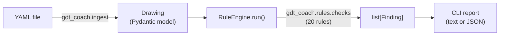

# gdt-coach

[](https://github.com/mustafabaylamak/gdt-coach/actions/workflows/ci.yml)
[](LICENSE)
[](pyproject.toml)

A deterministic rule engine that checks **GD&T (Geometric Dimensioning
and Tolerancing)** callouts on a drawing against **ASME Y14.5** rules,
and explains *why* each violation is wrong — not just that the input
was invalid.

```bash
$ gdt-coach check examples/invalid_flatness_with_datum.yaml
Checked examples/invalid_flatness_with_datum.yaml -- drawing 'dwg-002' ('Cover Plate')
Rules run: 20

[ERROR] flatness-no-datum-references: Flatness cannot reference datums
  flatness feature control frame 'fcf-1' references datum(s) ['A'], but flatness must not reference any datum
  location: feature=feat-surface-1 fcf=fcf-1

1 finding(s): 1 error
```

## Why

GD&T is a precise, symbolic language for specifying part geometry and
tolerances (ASME Y14.5 / ISO 1101). It's also easy to author
incorrectly in ways that look plausible: a flatness callout that
references a datum it shouldn't, a position tolerance on a surface
that isn't a Feature of Size, an MMC modifier on a characteristic that
must always be RFS. These mistakes are common, well-defined, and
mechanical to check — which makes them a good fit for an automated,
deterministic rule engine rather than manual review.

`gdt-coach` reads a drawing described in YAML, validates it into a
typed domain model, and runs it against a registry of independent
rules. Each violation comes back as a structured `Finding` — a rule id,
a severity, a human-readable explanation, and exactly which feature or
feature control frame it's about.

## Architecture



Four independent layers: a **domain model** (`gdt_coach.models`) that
knows nothing about GD&T rules, only what data is structurally valid; a
**rule engine** (`gdt_coach.rules`) that knows nothing about any
specific rule, only how to run one; 20 **concrete rules**
(`gdt_coach.rules.checks`), each an independent, self-registering
module; and a thin **YAML ingest** layer and **CLI** that wire the
pieces together. See [ARCHITECTURE.md](ARCHITECTURE.md) for the full
design, including every rule's known limitations.

## Installation

Requires Python 3.11+.

```bash
git clone https://github.com/mustafabaylamak/gdt-coach.git
cd gdt-coach
python -m venv .venv
source .venv/bin/activate  # On Windows: .venv\Scripts\activate
pip install -e ".[dev]"
pre-commit install
```

## Quick start

```bash
gdt-coach --version
gdt-coach check examples/valid_position.yaml         # exit 0, no findings
gdt-coach check examples/invalid_flatness_with_datum.yaml  # exit 1, one finding
```

Narrow which rules run, or get machine-readable output:

```bash
gdt-coach check examples/valid_position.yaml --category tolerance
gdt-coach check examples/invalid_projected_zone.yaml --json
```

See [examples/README.md](examples/README.md) for all six bundled
example drawings, what each one demonstrates, and their exact output
(generated from the real CLI, not hand-written).

Exit codes: `0` no findings, `1` one or more findings, `2` the input
couldn't be checked (malformed YAML, missing file, failed domain-model
validation, or an invalid `--category`/`--standard` value).

## Using it as a library

```python
from gdt_coach.ingest import load_drawing_from_yaml_file
from gdt_coach.rules import RuleEngine
import gdt_coach.rules.checks  # noqa: F401  (side effect: registers the rules)

drawing = load_drawing_from_yaml_file("examples/valid_position.yaml")
findings = RuleEngine().run(drawing)
for finding in findings:
    print(finding.severity, finding.title, finding.message)
```

Or build a `Drawing` directly, without YAML:

```python
from gdt_coach.models import Datum, DatumFeatureType, Drawing, Feature, FeatureType

drawing = Drawing(
    id="dwg-1",
    title="Bracket",
    features=[Feature(id="feat-1", feature_type=FeatureType.HOLE)],
    datums=[Datum(label="A", feature_type=DatumFeatureType.PLANE)],
)
```

### YAML format

The YAML mirrors the domain model directly: each mapping key is a
`gdt_coach.models` field name, nested the same way the models nest
(`Drawing` → `features`/`datums` → `dimensions`/
`feature_control_frames` → `tolerance`/`datum_references`). Enum fields
use the same lowercase value as the Python enum (e.g.
`characteristic: position`, `unit: mm`, `feature_type: hole`) — see
[enums.py](src/gdt_coach/models/enums.py) for every enum's exact
values. Unknown keys are rejected (the domain model forbids extra
fields), and every structural validation rule (a diameter must be
positive, tolerances can't be negative, and so on) still applies to
YAML-sourced data.

```yaml
id: dwg-001              # Drawing.id (required)
title: Mounting Bracket   # Drawing.title (required)
number: DWG-1001          # optional
revision: A               # optional
default_unit: mm          # optional, default: mm
scale: "1:1"               # optional

datums:                    # list[Datum], optional
  - label: A                # one or two uppercase letters
    feature_type: plane      # plane | axis | point | line | center_plane

features:                   # list[Feature], optional
  - id: feat-hole-1
    feature_type: hole        # hole | cylinder | plane | pin | slot | ...
    quantity: 4                # default: 1
    feature_of_size: true      # required by several rules -- see Limitations
    dimensions:                 # list[Dimension], optional
      - id: dim-1
        dimension_type: diameter # linear | angular | diameter | radius | ...
        nominal_value: 10.0
        unit: mm
        tolerance:                # optional; omit for a basic dimension
          upper_deviation: 0.05
          lower_deviation: 0.05
        role: size                 # size | location | orientation | other (default: other)
    feature_control_frames:       # list[FeatureControlFrame], optional
      - id: fcf-1
        characteristic: position   # one of the 14 ASME Y14.5 symbols
        tolerance:
          upper_deviation: 0.25
          lower_deviation: 0.25
          zone_shape: cylindrical    # linear | cylindrical | spherical | total_width
          material_condition: mmc     # rfs | mmc | lmc
        datum_references:
          - datum_label: A
          - datum_label: B
          - datum_label: C
        related_dimension_ids:      # list[str], optional, default: []
          - dim-1                     # ids of Dimensions that locate/orient this FCF
```

`related_dimension_ids` names the `Dimension`(s) that establish or
support a feature control frame (e.g. the basic location dimensions a
position tolerance applies to). Validation is structural only — every
id must be a non-empty string, and no id may repeat within one FCF —
it does **not** check that the id matches a real `Dimension` anywhere
on the drawing; that referential check belongs to the rule layer, not
the model. Resolution is scoped to the dimensions on the *same*
feature (`Dimension.id` is unique per feature, not drawing-wide) and is
checked by `related-dimension-must-be-defined`, alongside
`position-related-dimension-must-be-basic`,
`related-dimension-must-not-be-reference`, and
`angularity-related-dimension-must-be-angular`. See
[ARCHITECTURE.md](ARCHITECTURE.md#dimension-linkage).

`Dimension.role` (`size` | `location` | `orientation` | `other`,
default `other`) declares what a dimension is *used for*, independent
of `dimension_type` (which describes its numeric shape) and
`is_reference` (which marks it informational-only). It's never
inferred — an un-classified dimension defaults to `other` rather than
being guessed from `dimension_type`, so a `linear` dimension is `other`
unless explicitly marked `location` or `size`. See
[ARCHITECTURE.md](ARCHITECTURE.md#dimension-role).

## Project structure

```
gdt-coach/
├── src/gdt_coach/
│   ├── models/        # Pydantic domain model (Drawing, Feature, Datum, ...)
│   ├── rules/          # rule engine (Rule, Finding, RuleRegistry, RuleEngine)
│   │   └── checks/     # 20 concrete GD&T rules, one module per rule
│   ├── ingest/         # YAML loader (YAML -> Drawing)
│   └── cli.py          # `gdt-coach` command
├── tests/              # pytest suite, mirrors src/gdt_coach/ layout
├── examples/           # runnable example drawings (see examples/README.md)
├── docs/               # reserved for future deep-dive documentation
├── scripts/            # maintenance scripts (e.g. examples/README.md regeneration)
└── .github/workflows/  # CI
```

## Limitations

- **Not a full ASME Y14.5 implementation.** 20 rules exist today; many
  characteristics, modifiers, and composite-tolerancing scenarios
  aren't covered yet. See [ROADMAP.md](ROADMAP.md) for what's planned.
- **Not a CAD system.** There is no geometry engine and no 3D model —
  only the symbolic GD&T data a drawing's YAML declares.
- **YAML input only.** No PDF, DXF, image, or native CAD file
  ingestion.
- **Some rules depend on data the source YAML must supply correctly.**
  For example, Feature-of-Size rules trust an explicit
  `feature_of_size: true/false` flag — it is never inferred from
  `feature_type`, so an under-declared Feature of Size will produce a
  false-positive finding. Every such limitation is documented on its
  rule in [ARCHITECTURE.md](ARCHITECTURE.md#concrete-rules).
- **Not a certified compliance tool.** A clean `gdt-coach check` run
  means the implemented rules found no violations — it is not proof of
  ASME Y14.5 conformance.

See [PROJECT.md](PROJECT.md) for the full goals/non-goals.

## Roadmap

More GD&T rules, a small domain-model addition to support
"requires a basic dimension"-style rules, and Markdown/HTML report
output are next. See [ROADMAP.md](ROADMAP.md) for the complete,
up-to-date list of what's implemented and what's planned.

## Development

```bash
ruff check .          # lint
ruff format .         # format
mypy src              # type-check
pytest                # test (with coverage)
```

## Contributing

Contributions are welcome. See [CONTRIBUTING.md](CONTRIBUTING.md) for
conventions, how to add a new rule, and what's expected before opening
a pull request.

## License

[MIT](LICENSE) © Mustafa D. Abaylamak
